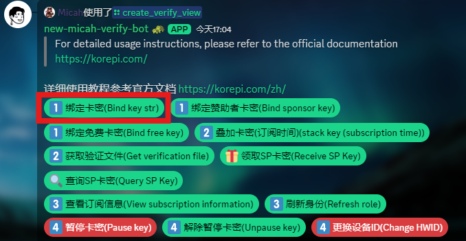
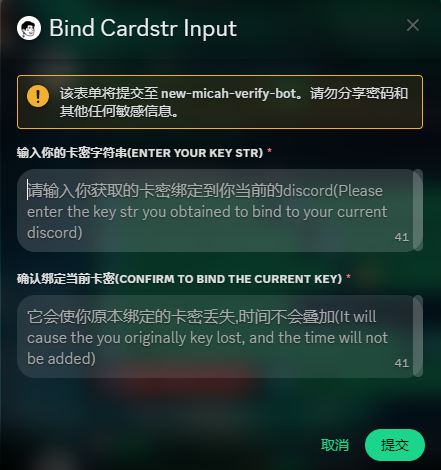
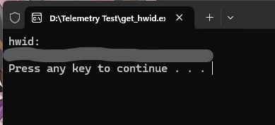
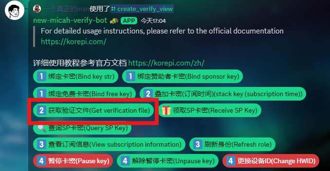
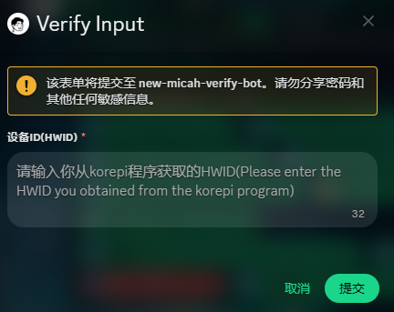
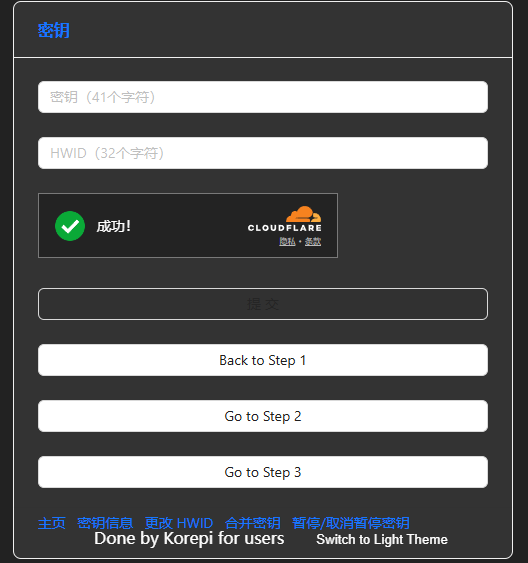
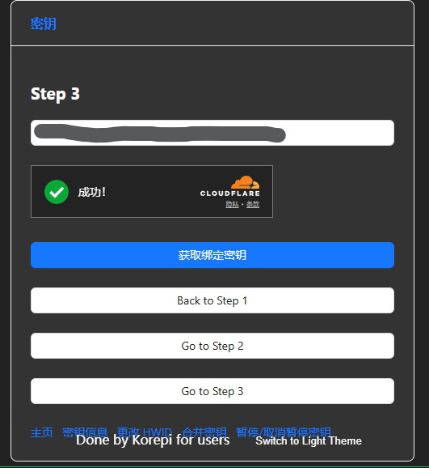
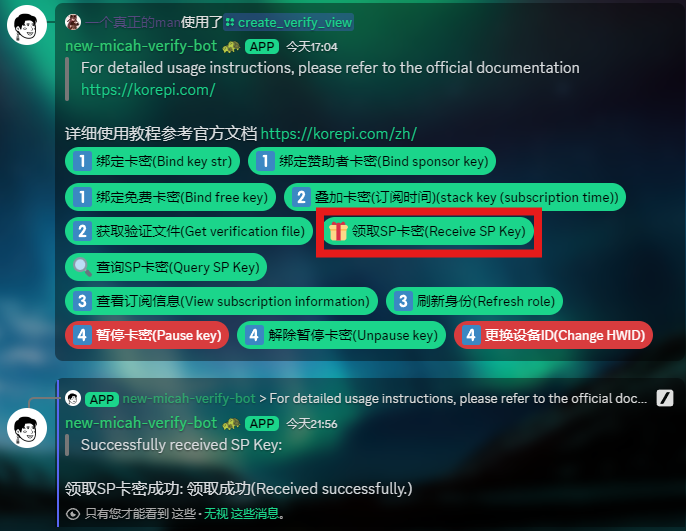
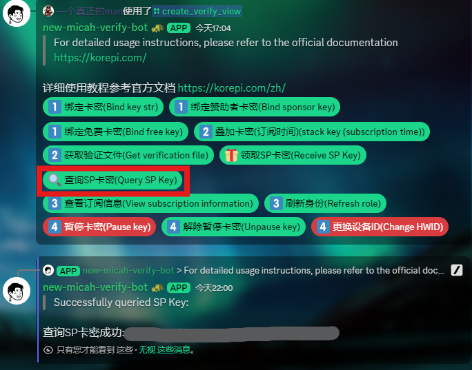
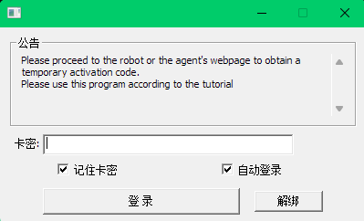

---

## 激活卡密及获取密钥文件的方法

- 请先到的 **ENTRY GATE** 下的 [`🔐｜verification`](https://discord.com/channels/1251244897021722735/1255892075371827313/1295311329040666727) 。

- 请根据指示输入并激活卡密。
- 购买订阅卡密者请点击`绑定卡密`,填写从各个渠道获取的密钥以获取PERTAMAX身份。
- 点击`领取SP卡密`并在之后点击`查询SP卡密`以便查看所拥有的卡密用以激活程序。
- 点击`使用卡密获取验证文件`,输入您的`hwid(设备id)`。
- 在那之后将频道最下方获取到的**enc.json**文件放入您的kp程序同级目录下,即可正常运行。
- 您还可以点击`查看订阅信息`，随时查看您的订阅详情。
:::danger 
:::

# 详细教程

## 使用所购买的卡密

__**1. 点击〖1️⃣ 绑定卡密(Bind card str)〗。**__

__**在弹出的窗口输入框处填入二遍从经销商处购买得来的41位卡密，并点击提交。**__

__**2. 在korepi程序文件夹内找到get_hwid程序并双击运行。届时将会弹出一个窗口，第二行即是您的HWID 请手动复制起来备用。**__

__**3. 点击〖2️⃣ 获取验证文件(Get verification file)〗，输入获取到的HWID，最后点击提交。**__

__**3 Ex. 您亦可通过[网页版(点击前往)](https://agent.korepi.com/)获取enc,json**__

__**第一个输入框填入购买的卡密，第二个输入框填入HWID。通过cloudflare验证后（卡验证时请自备梯子）蓝色的提交按钮将亮起，请点击它。**__

__**若资料正确无误将会弹出下载enc.json，请将其放入Korepi文件夹。**__

__**3 Ult. step2直接点击接收SP卡密，来到step3点击获取绑定密钥即可查询您所获得的SP卡密，请复制备用。（在网页端完成以上步骤的人可直接到第7步）**__

__**4. 下载此频道最下方最新消息提供的enc.json文件，并将文件放入Korepi文件夹。**__

   :::danger 请确保下载后的文件名为enc.json而不是其他名字比如enc (1).json。
   :::

__**5. 成功完成以上步骤获得PERTAMAX身份后，返回频道点击`🎁 Receive SP `。**__

__**6. 再点击`🔍 Query SP Key`，复制频道下方出现的SP卡密备用。**__

__**7. 运行Korepi程序，输入上一步得到的SP卡密并点击登录即可享受您的游戏啦。**__
   :::tip 勾选记住卡密与自动登录，可方便您下次启动时直接套用。
   :::

:::tip 视频教程（已过时）
:::
<iframe width="560" height="315" src="https://www.youtube.com/embed/N6odK8Q6LEE?si=LLIeftUPtpyNVKuE" title="YouTube video player" frameborder="0" allow="accelerometer; autoplay; clipboard-write; encrypted-media; gyroscope; picture-in-picture; web-share" allowfullscreen></iframe>

## sponsor使用教程

:::tip sponsor的密钥时间为7天，过期后请删除旧的enc.json文件，重新获取新的。
:::
:::danger 注意：sponsor身份已不再发放。
:::
__**1. 点击〖1️⃣ 绑定赞助者密钥(Bind sponsor card)〗**__

- 然后进入链接，自动绑定赞助密钥。

__**2. 打开你所下载的korepi，它会自动复制你的hwid码。**__
   :::tip 在你使用前看看你的korepi文件夹中是否有过期的enc.json文件，如果有的话，请删除。
   :::

__**3. 点击〖2️⃣ 获取验证文件(Get verification file)〗，输入hwid码，然后点击submit。**__

__**4. 下载enc.json文件，将文件放在korepi文件夹中。**__

__**5. 打开korepi，即可使用。**__

:::tip 视频教程 待更新！
:::

## 免费版使用教程

:::tip 免费的密钥时间为1天，过期后请删除旧的enc.json文件，重新获取新的。
:::

__**1. 点击〖1️⃣ 绑定免费卡密(Bind free card)〗。自动跳转看广告获取免费卡密。**__
 
 

__**成功后将在频道底部得到此信息**__

__**点击〖form link〗后将让您经历一段广告洗礼，并在最后出现以下提示**__
__** 一般会提示绑定成功(Binding success)**__

__**当您存在另个仍在活跃的密钥时，才会提示更新绑定成功(Update binding success) (已编辑)**__

__**2. 打开你所下载的korepi，它会自动复制你的hwid码。**__
   :::tip 在你使用前看看你的korepi文件夹中是否有过期的enc.json文件，如果有的话，请删除。
   :::

__**3. 点击〖2️⃣ 获取验证文件(Get verification file)〗，输入hwid码，然后点击submit。**__

__**4. 下载enc.json文件，将文件放在korepi文件夹中。**__

__**5. 打开korepi，即可使用。**__

:::tip 视频教程
:::

<iframe width="560" height="315" src="https://www.youtube.com/embed/WGmro7aRmOw?si=b1ywSsKaB-MU-cpT" title="YouTube video player" frameborder="0" allow="accelerometer; autoplay; clipboard-write; encrypted-media; gyroscope; picture-in-picture; web-share" allowfullscreen></iframe>

## 暂停卡密

# __**暂停和解除暂停卡密（仅限订阅者Subscription/PERTAMAX）**__

> __**暂停和解除暂停卡密的方法，每个月能暂停一次**__

## __暂停卡密__

__**1. 点击**〖4️⃣  暂停卡密(Pause card)〗**__

__**2. 在弹出的窗口输入框处输入『YES』（全大写），并点击Submit即可**__

## 解除暂停卡密

__**1.点击〖  解除暂停卡密(Unpause card)〗**__

__**2.在弹出的窗口输入框处输入『YES』（全大写），并点击Submit即可**__

## 更改设备

# __**更换设备**__

> __**更换密钥绑定的设备(HWID)的方法，每7天能更换一次**__

__**1. 点击**〖4️⃣  更换设备ID(Change HWID)〗**__

__**2. 在弹出的窗口输入框处填入您新的设备ID，并点击Submit**__

__**3. 打开你所下载的korepi，它会自动复制你的hwid码。**__
   :::tip 在你使用前看看你的korepi文件夹中是否有过期的enc.json文件，如果有的话，请删除。
   :::

__**4. 点击〖2️⃣ 获取验证文件(Get verification file)〗，输入hwid码，然后点击submit。**__

__**5. 下载enc.json文件，将文件放在korepi文件夹中。**__

__**6. 打开korepi，即可使用。**__
## md5校验问题

- 每次重新获得`enc.json`文件后,之前的`enc.json`文件都会失效
- 如果你最新获得的还是失效,请重新获得文件,如果还不行,等待一段时间后再试

## 上不了discord,谷歌等

[梯子推荐](../others/ap.md)

## 与bot交互失败
- 请在[rule频道](https://discord.com/channels/1069057220802781265/1075789470789546024)点击verify验证，bot就不会显示交互失败。
  
